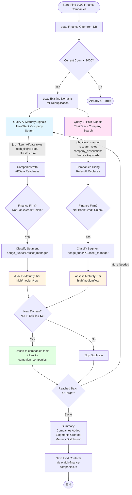

# Finance Company Discovery Workflow - Maturity-First Approach

## Strategy Overview

**Goal:** Build a list of 1,000 finance companies (hedge funds, PE firms, asset managers) segmented by:
- **Segment** (hedge_fund, private_equity, asset_manager, etc.)
- **Maturity Tier** (high, medium, low) - based on AI/data readiness signals

**Key Insight:** Target **readiness** (maturity), not just size. A 20-person firm with a Head of AI is more ready than a 200-person firm with zero technical talent.

---

## Workflow Diagram



---

## How It Works: Companies + Signals in One Go

### ✅ Efficient Approach (Using Company Search API)

**TheirStack Company Search API** (`/v1/companies/search`) lets us:
- **Find companies directly** (not jobs)
- **Filter by job signals** (`job_filters` parameter)
- **Filter by tech stack** (`tech_filters` parameter)
- **Get companies + matching jobs in response** (all in one call)

**Cost:** 3 credits per company returned (more efficient than job search → extract companies)

### ❌ Inefficient Approach (What We Were Doing)

1. Search jobs → Get 100s of jobs
2. Extract companies from jobs → Many duplicates
3. Dedupe companies → Extra work
4. Filter companies → Extra step

**Problem:** Job search returns many jobs per company, so we pay for jobs we don't need.

---

## Signal Types We're Looking For

### 1. **Maturity Signals** (AI/Data Readiness)

**What we're looking for:**
- Companies hiring **AI/data leadership** (Head of AI, Chief Data Officer, etc.)
- Companies hiring **data infrastructure roles** (Data Engineer, ML Engineer, etc.)
- Companies using **data infrastructure tech** (Snowflake, Databricks, dbt, LLMs)

**Why it matters:**
- These companies already believe AI works
- They have technical buyers who understand the value
- Skip the education phase → higher close rates

**TheirStack Query:**
```json
{
  "job_filters": {
    "job_title_pattern_or": [
      "Head of Data", "Director of Data", "VP Data",
      "Chief Data Officer", "CDO", "Head of AI",
      "AI Engineer", "Machine Learning", "ML Engineer",
      "Data Scientist", "Data Engineer", "Quant"
    ],
    "job_description_pattern_or": [
      "Snowflake", "Databricks", "dbt", "BigQuery",
      "LLM", "large language model", "machine learning"
    ],
    "posted_at_max_age_days": 365
  },
  "company_description_pattern_or": [
    "hedge fund", "private equity", "asset management",
    "investment management", "alternative investment"
  ],
  "limit": 25
}
```

### 2. **Pain Signals** (Roles AI Replaces/Augments)

**What we're looking for:**
- Companies hiring **manual research roles** (Research Analyst, Investment Analyst, etc.)
- Companies hiring **deal sourcing roles** (Deal Sourcing Analyst, Sourcing Analyst, etc.)

**Why it matters:**
- They're advertising the problem (need more manual research capacity)
- Perfect hook: "Here's how AI solves your exact problem"
- No pitch needed - just show them the solution

**TheirStack Query:**
```json
{
  "job_filters": {
    "job_title_pattern_or": [
      "Research Analyst", "Investment Analyst",
      "Equity Research", "Deal Sourcing",
      "Sourcing Analyst", "Operations Analyst"
    ],
    "posted_at_max_age_days": 365
  },
  "company_description_pattern_or": [
    "hedge fund", "private equity", "asset management"
  ],
  "limit": 25
}
```

---

## Segmentation Logic

### Segment Classification (from company name/description)

```typescript
function guessSegment(companyText: string): FinanceSegment {
  const t = companyText.toLowerCase()
  if (t.includes('hedge fund')) return 'hedge_fund'
  if (t.includes('private equity') || t.includes('buyout')) return 'private_equity'
  if (t.includes('asset management') || t.includes('investment management')) return 'asset_manager'
  if (t.includes('venture capital')) return 'venture_capital'
  return 'other'
}
```

### Maturity Tier Classification (from job signals)

```typescript
function guessMaturity(jobTitles: string[], techHits: string[]): MaturityTier {
  // High: Explicit AI/data leadership
  if (jobTitles.includes('Head of AI') || jobTitles.includes('Chief Data Officer')) {
    return 'high'
  }
  
  // Medium: Building data/ML infrastructure
  if (jobTitles.includes('Data Engineer') || jobTitles.includes('ML Engineer') || techHits.length > 0) {
    return 'medium'
  }
  
  // Low: No clear AI/data signals
  return 'low'
}
```

---

## Data Storage

### Companies Table
- `companies.domain` (unique per offer)
- `companies.vertical` → Segment (hedge_fund, private_equity, etc.)
- `companies.signals` → JSON with:
  - `segment_guess`
  - `maturity_tier`
  - `maturity_method`
  - `theirstack` (signal evidence)

### Campaign Companies Table
- Links companies to `finance-leadgen-1000` campaign
- Stores `added_reason` (which signal found them)
- Stores `source_query` (for traceability)

---

## Why This Approach Works

1. **Maturity-first targeting** → Higher close rates (they already believe AI works)
2. **Pain signals** → Perfect hook ("you're hiring for this problem, here's how AI solves it")
3. **Segmentation** → Different copy for hedge funds vs PE firms
4. **Efficient API usage** → Company Search API (3 credits/company) vs Job Search (many jobs per company)

---

## Next Steps After Discovery

Once companies are in the database:
1. **Find contacts** → Run `enrich-finance-companies.ts` (Exa for LinkedIn URLs)
2. **Enrich emails** → FullEnrich bulk enrichment (100 at a time)
3. **Segment copy** → Different email copy for:
   - Hedge funds (high maturity) → Technical arguments
   - PE firms (pain signals) → "Here's how AI solves your exact problem"
   - Asset managers → Custom positioning

---

## Cost Estimate

**Per batch of 200 companies:**
- TheirStack Company Search: ~600 credits (3 credits × 200 companies)
- Exa contact finding: ~200 credits (1 credit × 200 companies)
- FullEnrich email enrichment: ~200 credits (1 credit × 200 contacts)

**Total to reach 1,000:** ~4,200 credits across all APIs
